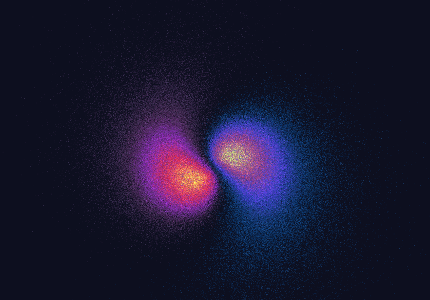
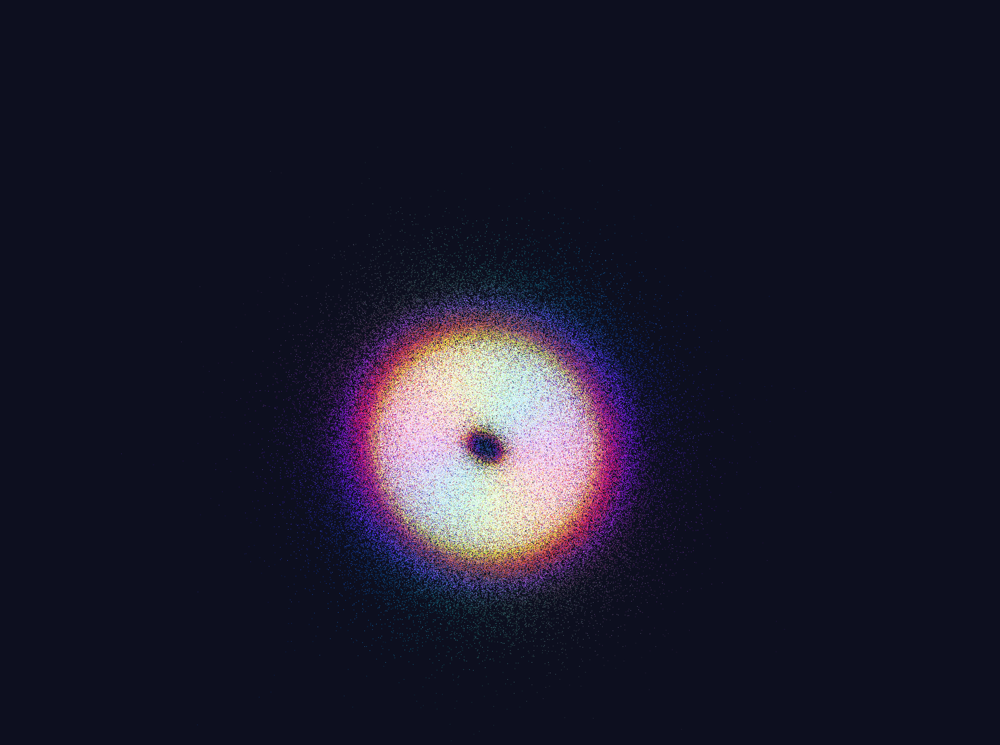
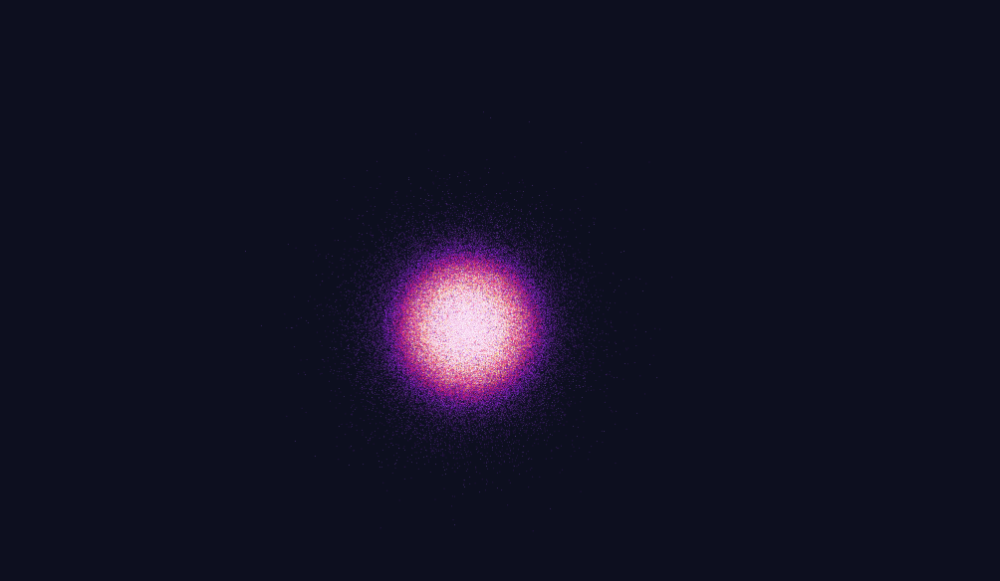
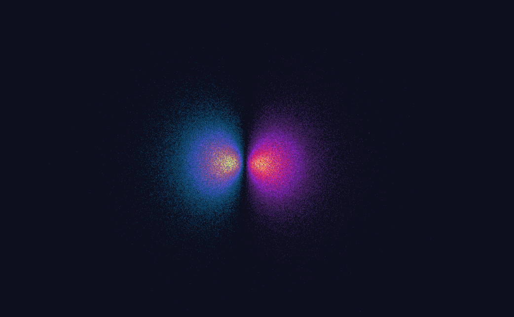
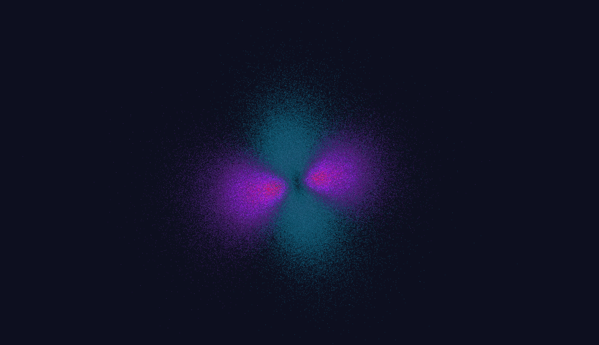
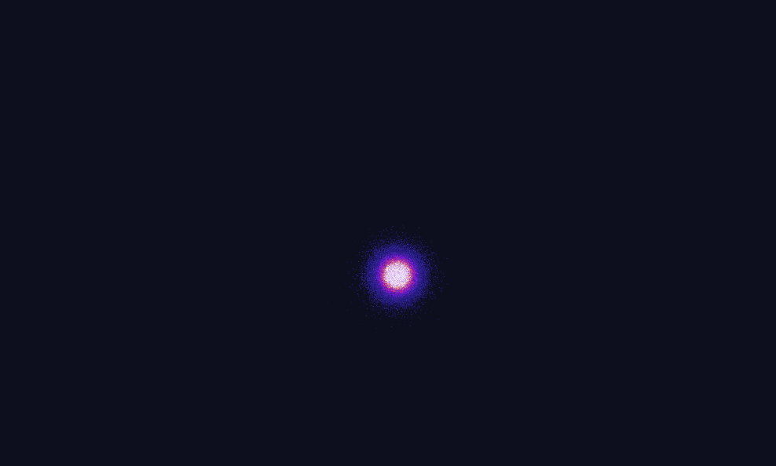

# **Hydrogen Quantum Orbital Visualizer**

Here is the raw code for the atom simulation, includes raytracer version, realtime runner, and 2D version

What the model does:
1. Takes the quantum numbers (n, l, m) that describe an orbital's shape
2. Using the schrodinger equation, sample r, theta, and phi coordinates from those quantum numbers
3. Render those possible positions and color code them relative to their probabilities (brighter areas have higher probability)


<p align="center">
  
  
  
</p>
<p align="center">
  
  
  
</p>

## **Building Requirements:**

1. C++ Compiler supporting C++ 17 or newer
2. [Cmake](https://cmake.org/)
3. [Vcpkg](https://vcpkg.io/en/)
4. [Git](https://git-scm.com/)
5. **Optional**: [Inter Font](https://github.com/rsms/inter/releases) - Download and place `Inter-Regular.ttf` in `fonts/` directory for better UI

## **Build Instructions:**

1. Clone the repository:
	-  `git clone https://github.com/huesss/Atom.git`
2. CD into the newly cloned directory
	- `cd ./Atom` 
3. Install dependencies with Vcpkg
	- `vcpkg install`
4. Get the vcpkg cmake toolchain file path
	- `vcpkg integrate install`
	- This will output something like : `CMake projects should use: "-DCMAKE_TOOLCHAIN_FILE=/path/to/vcpkg/scripts/buildsystems/vcpkg.cmake"`
5. Create a build directory
	- `mkdir build`
6. Configure project with CMake
	-  `cmake -B build -S . -DCMAKE_TOOLCHAIN_FILE=/path/to/vcpkg/scripts/buildsystems/vcpkg.cmake`
	- Use the vcpkg cmake toolchain path from above
7. Build the project
	- `cmake --build build`
8. Run the program
	- The executables will be located in the build folder

### Alternative: Debian/Ubuntu apt workaround

If you don't want to use vcpkg, or you just need a quick way to install the native development packages on Debian/Ubuntu, install these packages and then run the normal CMake steps above:

```bash
sudo apt update
sudo apt install build-essential cmake \
	libglew-dev libglfw3-dev libglm-dev libgl1-mesa-dev
```

This provides the GLEW, GLFW, GLM and OpenGL development files so `find_package(...)` calls in `CMakeLists.txt` can locate the libraries. After installing, run the `cmake -B build -S .` and `cmake --build build` commands as shown in the Build Instructions.

## **How the code works:**
the 2D bohr model works is in atom.cpp, the raytracer and realtime models are right beside
* warning, I would recommend running the realtime model with <100k particles first to be sure, raytracer is super compu-intensive so make sure your system can handle it!

## **Controls:**
- `TAB` - Toggle between quantum and classical modes
- `P` - Toggle debug log
- `1`, `2`, `3` - Switch to n=1, n=2, n=3 orbitals (instant, no lag)
- `[` / `]` - Decrease/increase principal quantum number n
- `,` / `.` - Decrease/increase angular momentum l
- `;` / `'` - Decrease/increase magnetic quantum number m
- `-` / `=` - Decrease/increase particle count
- `V` - Toggle VSync on/off
- `R` - Regenerate particle cloud
- `Mouse Wheel` - Adjust time scale (0.1x - 10.0x, smooth)
- `W/A/S/D` - Move camera
- `Q/E` - Move camera down/up
- `Space/Ctrl` - Move camera up/down
- `ESC` - Exit

## **Performance Optimizations:**
- **CDF Table Caching**: Quantum number tables cached - instant mode switching (no recalculation)
- **Progressive Generation**: 20k particles/frame - zero lag on 1/2/3 keys
- **Lazy Regeneration**: Only regenerate when quantum numbers actually change
- **Buffer Update Throttling**: GPU updates @ 60 FPS, not every frame
- **Optimized Math**: Pre-computed sin/cos, reduced trig calls by 60%
- **Mapped Buffers**: glMapBuffer for 2x faster GPU memory updates
- **Smart Sampling**: 32x fewer points for rhoMax calculation
- **Adaptive Quality**: Default 180k particles (10k-650k range)

## **Time Scale Control:**
- Use **mouse wheel** to adjust simulation speed
- Range: 0.1x (slow-motion) to 10.0x (fast-forward)
- Smooth interpolation with visual feedback
- Color-coded indicator (red=fast, blue=slow, white=normal)
- Progress bar shows current speed visually
